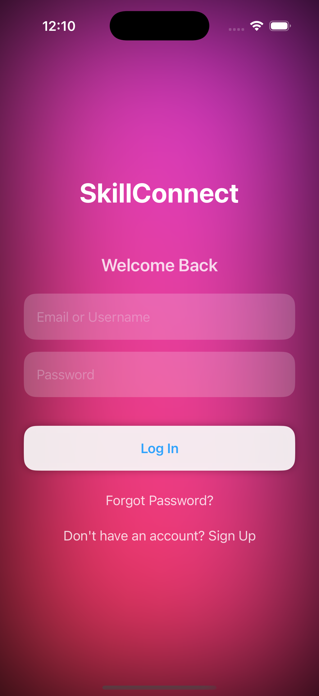
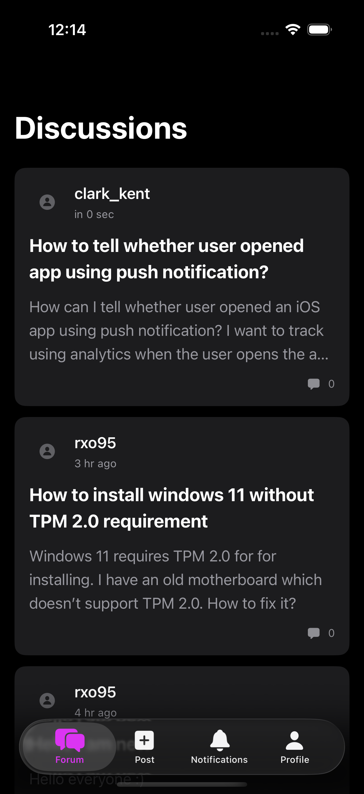
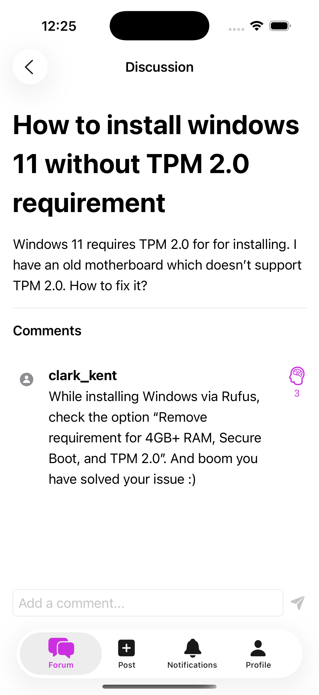
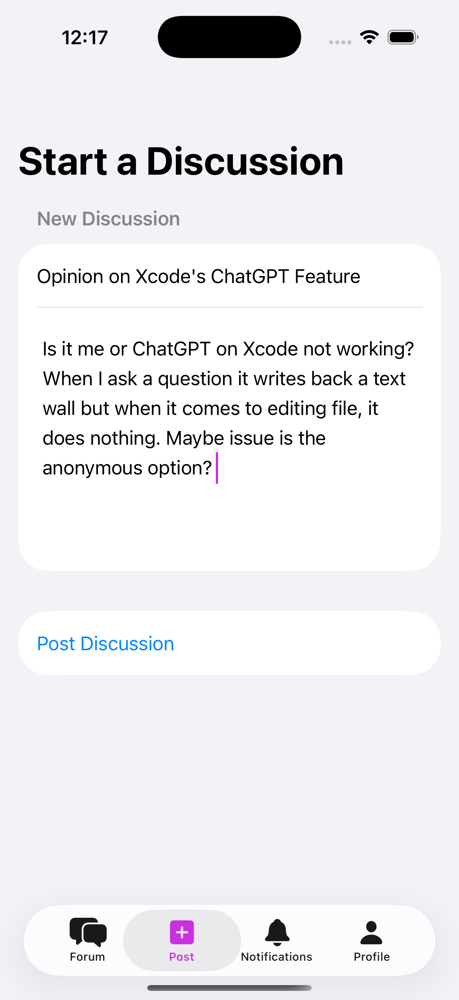
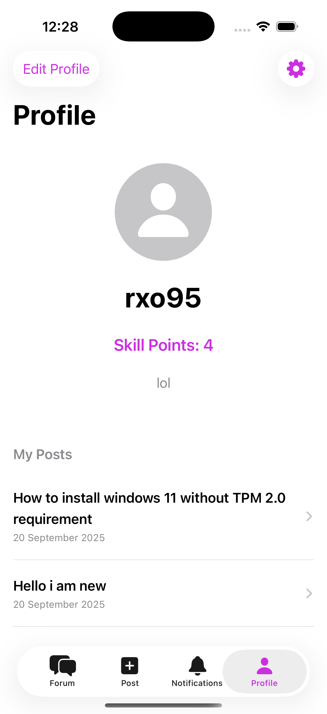
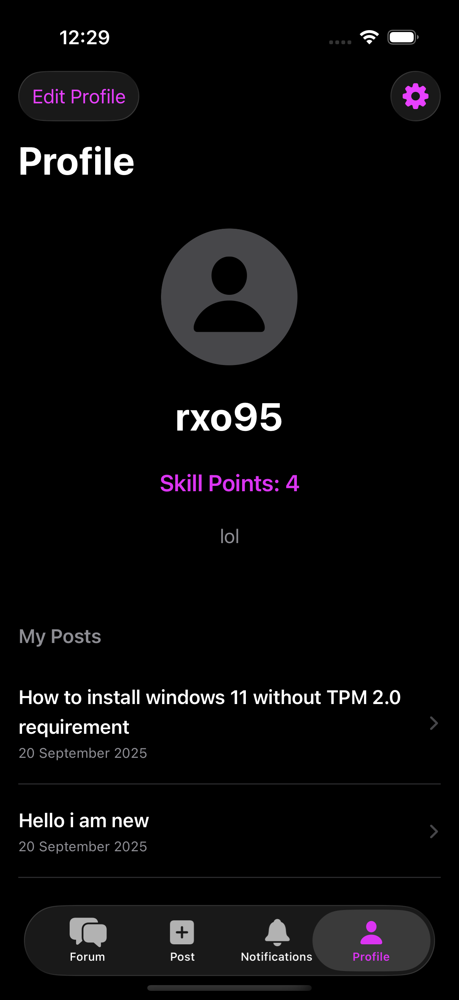

# SkillConnect

A modern, community-driven discussion forum built natively for iOS with SwiftUI. SkillConnect empowers users to connect by sharing and rewarding knowledge through a unique Skill Points system, creating a reputation-based platform centered on expertise and meaningful interactions.

## Features

- Full Authentication Flow: Secure sign-up, login (email/username), password reset, and session persistence.
- Dynamic Discussion Forum: Real-time feed of posts with a modern, card-based UI.
- Interactive Commenting System: Add comments, ask questions, and engage with discussions.
- Unique Skill Points System: Reward insightful comments, build a trusted reputation.
- Customizable User Profiles: Edit username, bio, and upload custom profile pictures.
- Personalized Feeds: Profile page shows all posts by a specific user.
- Advanced Theming: Light, Dark, System, and an Animated theme applied globally.
- Real-Time Updates: Firestore snapshot listeners for instant UI refresh.
- Push Notifications (Bonus): Stay updated on new comments or rewards (requires Firebase Cloud Messaging setup).
- Analytics Integration (Bonus): Firebase Analytics to track user engagement and feature adoption.
- Unit & UI Testing (Bonus): XCTest cases for critical features to ensure app reliability.

## Technology Stack

- UI: SwiftUI
- Language: Swift (with modern async/await concurrency)
- Backend: Firebase
  - Authentication: User management
  - Firestore: Real-time NoSQL database
  - Storage: Profile picture hosting
  - Cloud Messaging: Push notifications (optional)
  - Analytics: User engagement insights (optional)
- State Management: Combine
- Architecture: MVVM (Model-View-ViewModel)
- Version Control: Git + GitHub CI/CD (bonus for professional workflow)

## Setup & Installation

1. Clone the Repository:
    ```bash
    git clone https://github.com/YOUR_USERNAME/SkillConnect.git
    cd SkillConnect
    ```
2. Create a Firebase Project:
   - Go to [Firebase Console](https://console.firebase.google.com/) and create a new project.
   - Add an iOS app with your bundle identifier.
   - Enable Authentication (Email/Password), Firestore, and Storage.
3. Add `GoogleService-Info.plist`:
   - Download from your Firebase settings.
   - Place it in the root of your Xcode project (SkillConnect/).
   - (Note: Already in `.gitignore`, do NOT commit this file.)
4. Open and Run:
   - Open `SkillConnect.xcodeproj` in Xcode.
   - Build and run on an iOS simulator or device.

## Screenshots

<p align="center">
  
</p>


<p align="center">
  
  
  
  
  
  
</p>


## License

This project is licensed under the MIT License.


## Author
Rakshit Kumar
